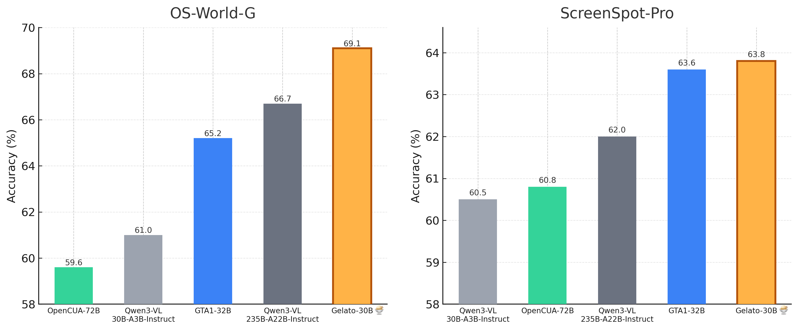
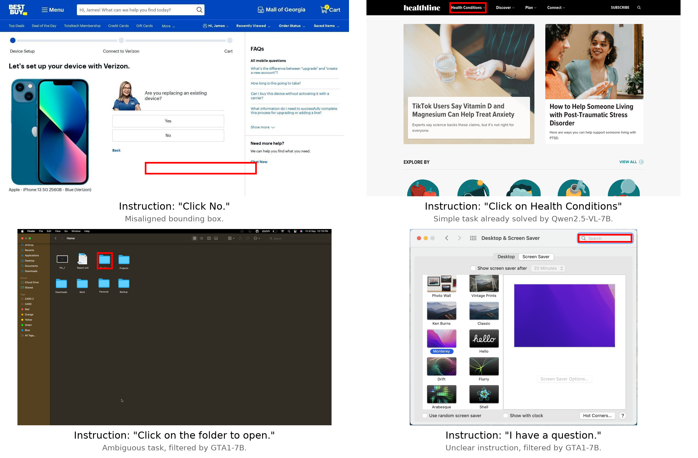
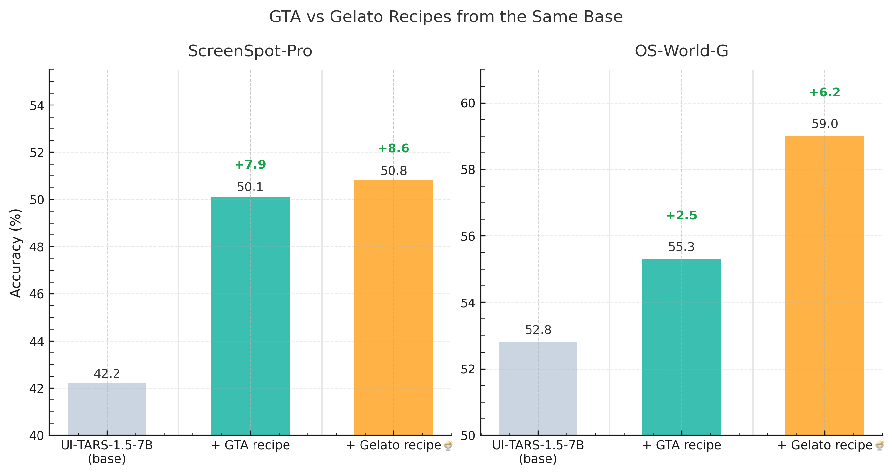
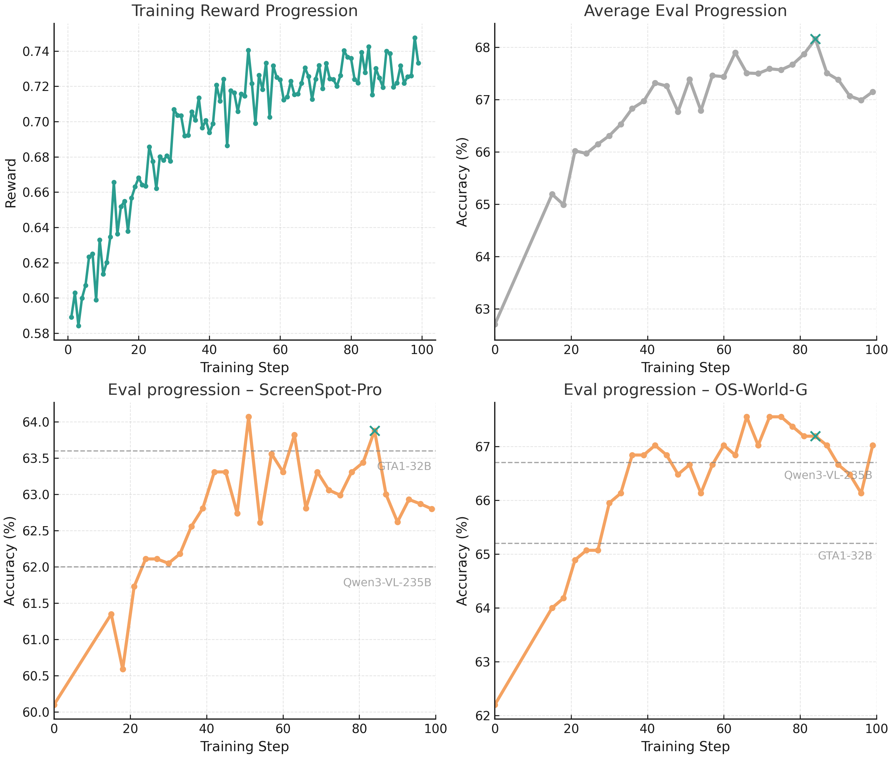
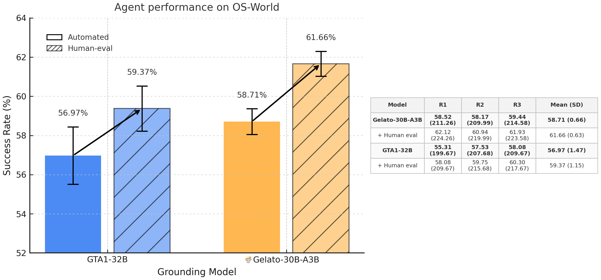

# 🍨 Gelato — From Data Curation to Reinforcement Learning: Building a Strong Grounding Model for Computer-Use Agents

[🍨 **Gelato-30B-A3B (model)**](https://huggingface.co/mlfoundations/Gelato-30B-A3B) | [🖱️ **Click-100k (dataset)**](https://huggingface.co/datasets/mlfoundations/Click-100k) | [🔗 **Training Instructions**](./training_configs) | [📈 **Evaluation**](./evaluation)

  
> **Figure 1:** 🍨 Gelato-30B-A3B outperforms the SoTA specialized computer grounding model, GTA1-32B, and larger VLMs on the ScreenSpot-Pro and OS-World-G grounding benchmarks.

We are releasing [**🍨 Gelato-30B-A3B**](https://huggingface.co/mlfoundations/Gelato-30B-A3B), a state-of-the-art grounding model for GUI computer-use tasks! Gelato is trained on our open-sourced [**🖱️ Click-100k**](https://huggingface.co/datasets/mlfoundations/Click-100k) dataset and achieves **63.88% accuracy on ScreenSpot-Pro**<sup>[[3](#ref-screenspot-pro)]</sup> and **69.15% / 74.65% on OS-World-G / OS-World-G (Refined)**<sup>[[4](#ref-jedi)]</sup>, surpassing prior specialized computer grounding models like GTA1-32B <sup>[[5](#ref-gta1)]</sup> and much larger VLMs including Qwen3-VL-235B-A22B-Instruct <sup>[[10](#ref-qwen3vl)]</sup>. When combined with GPT-5, Gelato enables strong agentic performance at **58.71%** automated success rate (**61.85%** with human evaluation) vs. **56.97%** (**59.47%** with human evaluation) for GTA1-32B on OS-World.

## Building the Click-100k Dataset

**Click-100k** pairs computer screen frames with low-level GUI commands and click coordinates.
We build the dataset by filtering and unifying multiple public data sources — *ShowUI*<sup>[[1](#ref-showui)]</sup> (Web/Desktop), *AutoGUI*<sup>[[2](#ref-autogui)]</sup>, *PC-Agent-E*<sup>[[18](#ref-pcagente)]</sup>, *WaveUI*<sup>[[17](#ref-waveui-25k)]</sup>, *OS-Atlas*<sup>[[13](#ref-osatlas)]</sup>, *UGround*<sup>[[16](#ref-uground)]</sup>, *PixMo*<sup>[[8](#ref-pixmo)]</sup>, and *SeeClick*<sup>[[7](#ref-seeclick)]</sup> — and then enrich the data pool with additional professional application data.

We first normalize all grounding data sources into a unified format, selecting a maximum of 50k instances per source to avoid skewing the dataset. PC-Agent-E and PixMo Points require additional processing.
For PC-Agent-E, we extract click actions from recorded computer-use trajectories and derive corresponding natural-language instructions by passing the reasoning chain for each action through Claude 3.7 Sonnet.
For PixMo Points, we use Qwen2.5-7B-VL to filter for samples depicting valid computer screen images.


> **Figure 2:** Existing open-source datasets contain numerous trivial samples that offer little value and many examples featuring misaligned or ambiguous instructions.  

After normalization, we **apply additional filtering to eliminate noisy and trivial samples**. The main issues we encounter are:

1. *Overly simple interactions* (e.g., trivial hyperlink clicks).  
2. *Misaligned instructions*, where text and target region diverge.

<p align="center">
  
</p>

> **Figure 3:** Using prior grounding models as difficulty and alignment filters improves dataset quality and downstream performance.  

To address these issues, we use [OmniParser](https://github.com/microsoft/OmniParser)<sup>[[6](#ref-omniparser)]</sup> to discard cases where the target click lies outside detected UI elements. We also employ existing grounding models as difficulty and alignment judges: Qwen2.5-7B-VL and SE-GUI-3B remove overly simple examples (similar to the data cleaning method used in SE-GUI<sup>[[14](#ref-se-gui)]</sup>), while GTA1-7B-2507 and UI-Venus-7B<sup>[[19](#ref-uivenus)]</sup> filter out misaligned ones (*Note: OS-Atlas was not included in these ablations but is filtered using the same procedure and included in the final dataset*).

To validate this approach, we fine-tune Qwen2.5-7B-VL on a source-balanced 10k subset and evaluate it on ScreenSpot-Pro<sup>[[3](#ref-screenspot-pro)]</sup>. We find that using Qwen2.5-7B-VL as the difficulty filter and GTA1-7B-2507 as the alignment filter produces a **+9 pp accuracy gain** over unfiltered data and outperforms other filtering model combinations. 

---

### Supplementing with Professional Application Usage Data

  
> **Figure 4:** Examples of grounding data synthesized from professional application videos. Instructions are shown below, and red boxes mark click targets.  

Existing sources lack **professional application coverage**, a key gap for general-purpose computer-use agents.
We address this by adding data from UI-VISION<sup>[[12](#ref-uivision)]</sup> and Jedi<sup>[[4](#ref-jedi)]</sup> (specifically the subset containing spreadsheet and text-cell manipulation examples). To broaden coverage, we also curate samples from **80+ professional application tutorial videos** ([list](assets/video_tutorials.txt)). Claude 4 Sonnet generates click bounding boxes and low-level instructions from video frames, which we manually inspect and occasionally correct. The professional application data undergoes the same filtering pipeline described above.

Finally, we apply additional refinements:

- For data sources without native bounding boxes, we remove samples where the Omniparser bounding box is too large (over 5% of screen area), which correlates with incorrect detections.
- We exclude *SeeClick*, *PixMo*, and *UGround* during RL training because they have a high proportion of ambiguous annotations that aren't all filtered out by the previous steps.

## Training Gelato-30B-A3B with GRPO

We train **Gelato-30B-A3B** using the GRPO algorithm<sup>[[9](#ref-grpo)]</sup>, building on prior reinforcement learning techniques for computer-use grounding.
Following DAPO<sup>[[15](#ref-dapo)]</sup>, we simplify the objective by removing the KL-divergence term, setting clip-higher threshold to *0.28*, and skipping zero-advantage rollouts. As in GTA1<sup>[[5](#ref-gta1)]</sup>, we use a sparse reward function that only rewards clicks within the target bounding box.

### How does the Gelato recipe compare to GTA1?
<p align="center">
  
</p>

> **Figure 5:** 🍨 Gelato provides substantial gains over the GTA1 recipe, resulting in much stronger performance on OS-World-G.

To evaluate the overall effectiveness of the Gelato training recipe, we compare it against the leading open-source model, GTA1<sup>[[5](#ref-gta1)]</sup>. We initialize RL training from UI-TARS-1.5-7B<sup>[[11](#ref-uitars)]</sup> (as done for GTA1-7B-2507) and train on Click-100k until convergence (255 steps). Gelato outperforms GTA1-7B-2507 on both ScreenSpot-Pro and OS-World-G, with particularly large improvements on OS-World-G. We open-source the UI-TARS-1.5-7B + Gelato baseline model at [mlfoundations/Gelato-UI-TARS-1.5-7B](https://huggingface.co/mlfoundations/Gelato-UI-TARS-1.5-7B).

---

### Gelato-30B-A3B

<p align="center">
  
</p>

> **Figure 6:** Training progression of 🍨 Gelato-30B-A3B showing steady improvements on training reward and mean evaluation performance on ScreenSpot-Pro, OS-World-G, and OS-World-G (refined). Best performance is achieved at step 84, marked with a green cross, with **63.88%** accuracy on ScreenSpot-Pro and **67.19%** / **73.40%** accuracy on OS-World-G / OS-World-G (Refined). Eliciting refusal improves accuracy on OS-World-G to **69.15%** / **74.65%**.

We initialize Gelato-30B-A3B from [Qwen3-VL-30B-A3B-Instruct](https://huggingface.co/Qwen/Qwen3-VL-30B-A3B-Instruct)<sup>[[10](#ref-qwen3vl)]</sup> and train with the DAPO setup for 100 steps on 32 40GB A100 GPUs. Training delivers strong improvements over the base model: +**3.38pp** accuracy on ScreenSpot-Pro and +**6.19pp** accuracy on OS-World-G. The best universal checkpoint occurs at **step 84**, determined by mean performance across ScreenSpot-Pro, OS-World-G, and OS-World-G (refined). We release all intermediate checkpoints for further research and analysis. See [per-step evaluations](evaluation/gelato-30b-a3b-per-step-evals.md) for detailed performance metrics.

#### Eliciting refusal from Gelato-30B-A3B

We elicit refusal behavior, the ability to decline grounding when the target element cannot be located, from Gelato-30B-A3B without explicitly training for it. By appending ‘If you cannot find the element, return refusal’ to the instruction prompt and including refusal cases in the evaluation (previously treated as zero-accuracy), we raise overall accuracy on OS-World-G to **69.15%** (+1.96 pp) and on OS-World-G (Refined) to **74.65%** (+1.25 pp).

## OS-World Agent

To measure end-to-end agent performance, we evaluate Gelato-30B-A3B on the OS-World benchmark as the grounding module together with GPT-5.

### Agent Harness
We evaluate Gelato-30B-A3B as a computer-use agent on OS-World using the [GTA1.5 agent framework](https://github.com/xlang-ai/OSWorld/blob/ddb8372a6cbb51a29583cc1c0fe8c090e61219b7/mm_agents/gta1/gta15_agent.py). The agent uses GPT-5 as a planning model and has a maximum of 50 steps, waiting 3 seconds between actions. We made minor modifications to the agent code, including a change to properly invoke the spreadsheet cell modification tool and an additional delay between trajectory completion and evaluation to ensure the VM state fully updates. See our modified implementation in [gelato_agent.py](./evaluation/os-world/gelato_agent.py).

### Reproducibility Issues
We found that many of the issues discussed in the [EpochAI article critiquing OS-World](https://epoch.ai/blog/what-does-osworld-tell-us-about-ais-ability-to-use-computers) significantly affect reproducibility. Benchmarking agent performance proved challenging due to:
1) Non-deterministic planner behavior combined with insufficient trial repetitions, making fair comparison against prior work difficult.
2) Changing evaluation prompts without explicit versioning.
3) Incomplete evaluation coverage and ambiguous task specifications that fail to recognize valid alternative solutions.

<p align="center">
  
</p>

> **Figure 7:** OS-World agent performance across three runs with GPT-5 planner. Automated evaluation underestimates performance due to incomplete task specifications. Human evaluation shows 🍨 Gelato-30B-A3B achieves **61.85%** success rate vs. GTA1-32B's **59.47%**.

To enable fair comparison, we ran three trials for both Gelato-30B-A3B and GTA1-32B in the same agent harness. The experiments were conducted in a [fixed snapshot of OS-World](https://github.com/xlang-ai/OSWorld/tree/ddb8372a6cbb51a29583cc1c0fe8c090e61219b7). Gelato-30B-A3B achieves **58.71 ± 0.66% success rate** on OS-World automated evaluation, performing on par or above GTA1-32B (**56.97 ± 1.47%** success rate). We provide all of our agent's OS-World trajectories at [mlfoundations/gelato-osworld-agent-trajectories](https://huggingface.co/datasets/mlfoundations/gelato-osworld-agent-trajectories).

### Human Evaluation

We manually identified 20 tasks where the evaluation function is incomprehensive or the task specification is ambiguous. For each task, we review all agent trajectories and determine whether the task was successfully completed. With human evaluation corrections, Gelato-30B-A3B achieves **61.85 ± 0.79%** success rate compared to the automated evaluation result of **58.71 ± 0.66%**. Similarly, GTA1-32B achieves **59.47 ± 1.27%** success rate with human evaluation compared to **56.97 ± 1.47%** on automated evaluation.

See [evaluation/osworld-human-evals.md](evaluation/osworld-human-evals.md) for detailed results. This is not a comprehensive manual evaluation, we identified clearly problematic tasks that were also easy to check.

## Team

**Contributors:** Anas Awadalla*, Dhruba Ghosh*, Aylin Akkus*, Yuhui Zhang, Marianna Nezhurina

**Advisors:** Jenia Jitsev, Yejin Choi†, Ludwig Schmidt†

<sup>* Core contributors</sup>
<sup>† Equal advising</sup>

## Acknowledgments
We thank Florian Brand for sharing details on OS-World task quality issues and Yan Yang for details on GTA1 agent evaluation. 

We gratefully acknowledge computing time granted for the project synthesis by the JARA on the supercomputer JURECA at Juelich Supercomputing Center (JSC) and storage resources on JUST granted and operated by JSC and supported by Helmholtz Data Federation (HDF).

## Citation  
If you use **🍨 Gelato** in your research, please cite it as follows:  

```
@misc{gelato2025,
  title={Gelato — From Data Curation to Reinforcement Learning: Building a Strong Grounding Model for Computer-Use Agents},
  author={Anas Awadalla, Dhruba Ghosh, Aylin Akkus, Yuhui Zhang, Marianna Nezhurina, Jenia Jitsev, Yejin Choi, Ludwig Schmidt},
  year={2025},
  publisher={GitHub},
  howpublished={\url{https://github.com/mlfoundations/gelato}},
}
```

## References
<small>

1. <a id="ref-showui"></a>**ShowUI:** Lin et al. *"ShowUI: One Vision-Language-Action Model for GUI Visual Agent."* [arXiv:2411.17465](https://arxiv.org/abs/2411.17465) (2024).
2. <a id="ref-autogui"></a>**AutoGUI:** Li et al. *"AutoGUI: Scaling GUI Grounding with Automatic Functional Annotation."* [arXiv:2502.01977](https://arxiv.org/abs/2502.01977) (2025).
3. <a id="ref-screenspot-pro"></a>**ScreenSpot-Pro:** Li et al. *"ScreenSpot-Pro: GUI Grounding for Professional High-Resolution Computer Use."* [arXiv:2504.07981](https://arxiv.org/abs/2504.07981) (2025).
4. <a id="ref-jedi"></a>**OS-World-G / JEDI:** Xie et al. *"Scaling Computer-Use Grounding via User Interface Decomposition and Synthesis."* [arXiv:2505.13227](https://arxiv.org/abs/2505.13227) (2025).
5. <a id="ref-gta1"></a>**GTA1:** Yang et al. *"GTA1: GUI Test-time Scaling Agent."* [arXiv:2507.05791](https://arxiv.org/abs/2507.05791) (2025).
6. <a id="ref-omniparser"></a>**OmniParser:** Lu et al. *"OmniParser for Pure Vision Based GUI Agent."* [arXiv:2408.00203](https://arxiv.org/abs/2408.00203) (2024).
7. <a id="ref-seeclick"></a>**SeeClick:** Cheng et al. *"SeeClick: Harnessing GUI Grounding for Advanced Visual GUI Agents."* [arXiv:2401.10935](https://arxiv.org/abs/2401.10935) (2024).
8. <a id="ref-pixmo"></a>**PixMo Points:** Deitke et al. *"Molmo and PixMo: Open Weights and Open Data for State-of-the-Art Vision-Language Models."* [arXiv:2409.17146](https://arxiv.org/abs/2409.17146) (2024).
9. <a id="ref-grpo"></a>**GRPO:** Shao et al. *"DeepSeekMath: Pushing the Limits of Mathematical Reasoning in Open Language Models."* [arXiv:2402.03300](https://arxiv.org/abs/2402.03300) (2024).
10. <a id="ref-qwen3vl"></a>**Qwen3-VL:** Qwen Team. *"Qwen3 Technical Report"* [arXiv:2505.09388](https://arxiv.org/abs/2505.09388) (2025).
11. <a id="ref-uitars"></a>**UI-TARS 1.5:** Qin et al. *"UI-TARS: Pioneering Automated GUI Interaction with Native Agents."* [arXiv:2501.12326](https://arxiv.org/abs/2501.12326) (2025).
12. <a id="ref-uivision"></a>**UI-VISION:** Nayak et al. *"UI-Vision: A Desktop-centric GUI Benchmark for Visual Perception and Interaction."* [arXiv:2503.15661](https://arxiv.org/abs/2503.15661) (2025).
13. <a id="ref-osatlas"></a>**OS-Atlas:** Wu et al. *"OS-ATLAS: A Foundation Action Model for Generalist GUI Agents."* [arXiv:2410.23218](https://arxiv.org/abs/2410.23218) (2024).
14. <a id="ref-se-gui"></a>**SE-GUI:** Yuan et al. *"Enhancing Visual Grounding for GUI Agents via Self-Evolutionary Reinforcement Learning."* [arXiv:2505.12370](https://arxiv.org/abs/2505.12370) (2025).
15. <a id="ref-dapo"></a>**DAPO:** Yu et al. *"DAPO: An Open-Source LLM Reinforcement Learning System at Scale."* [arXiv:2503.14476](https://arxiv.org/abs/2503.14476) (2025).
16. <a id="ref-uground"></a>**UGround:** Gou et al. *"Navigating the Digital World as Humans Do: Universal Visual Grounding for GUI Agents."* [arXiv:2410.05243](https://arxiv.org/abs/2410.05243) (2024).
17. <a id="ref-waveui-25k"></a>**WaveUI-25k:** AgentSea. *"WaveUI-25k."* [HF dataset card](https://huggingface.co/datasets/agentsea/wave-ui-25k) (2024).
18. <a id="ref-pcagente"></a>**PC-Agent-E:** He et al. *"Efficient Agent Training for Computer Use."* [arXiv:2505.13909](https://arxiv.org/abs/2505.13909) (2025).
19. <a id="ref-uivenus"></a>**UI-Venus:** Gu et al. *"UI-Venus Technical Report: Building High-Performance UI Agents with RFT."* [arXiv:2508.10833](https://arxiv.org/abs/2508.10833) (2025).

</small>
